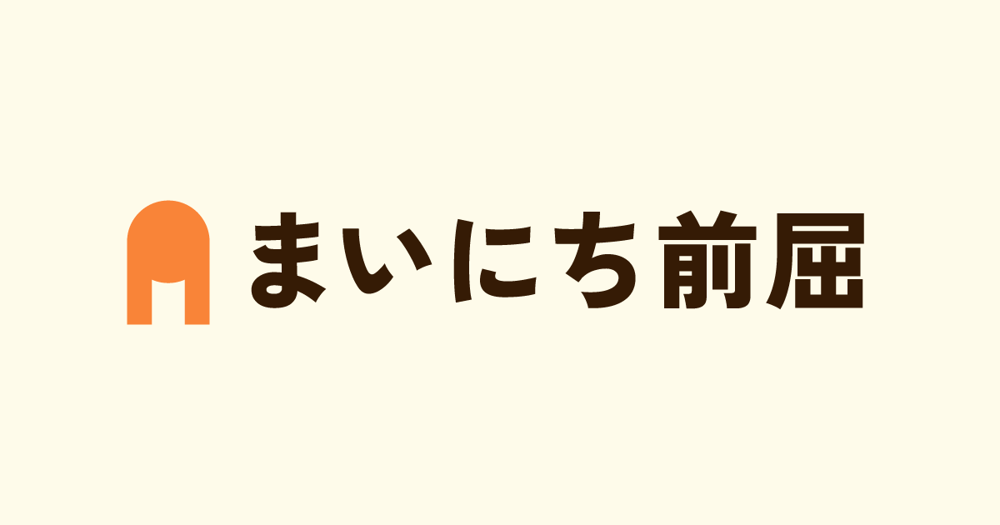
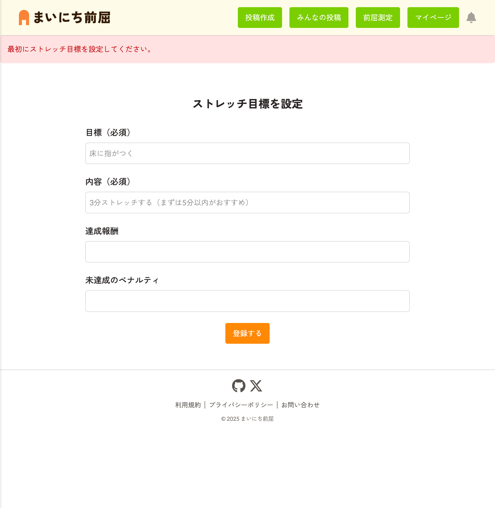
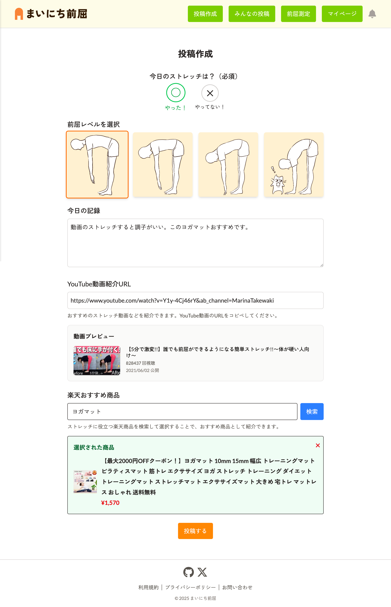
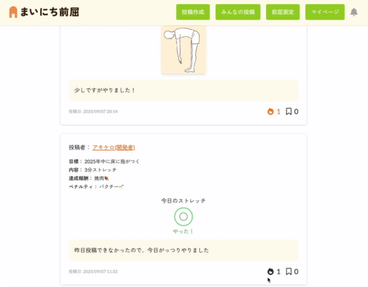
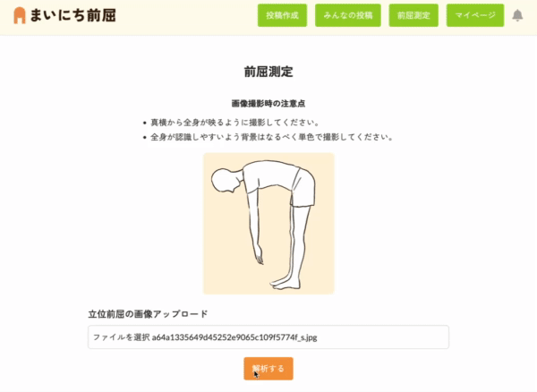
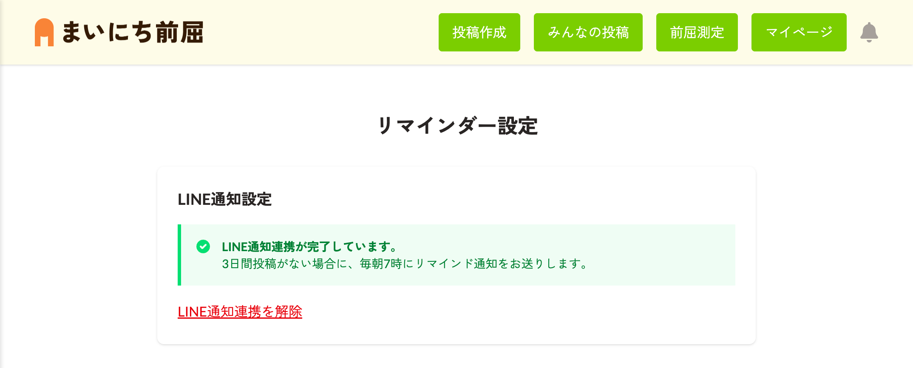
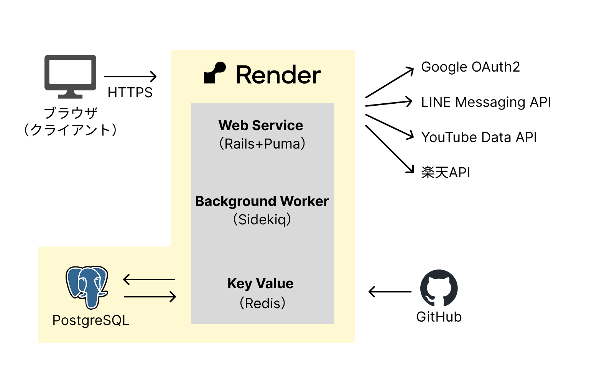

# まいにち前屈

サービスURL : https://mainichi-zenkutsu.jp/
技術記事 : [前屈サポートアプリ「まいにち前屈」をリリース【個人開発】](https://qiita.com/akikero/items/45fc50b87d2f5a46691e#%E3%82%A4%E3%83%B3%E3%83%95%E3%83%A9)

## ■ 目次
- [サービス概要](#-サービス概要)
- [サービス開発の背景](#-サービス開発の背景)
- [ユーザー層について](#-ユーザー層について)
- [主な機能紹介](#-主な機能紹介)
- [サービスの推しポイント](#-サービスの推しポイント)
- [機能一覧](#-機能一覧)
- [使用技術](#-使用技術)
- [インフラ構成](#-インフラ構成)
- [画面遷移図](#-画面遷移図)
- [ER図](#-er図)

## ■ サービス概要
前屈が苦手、体が硬い、でもジム通いや整体は続かない…そんな方のためのストレッチ記録アプリです。前屈をテーマに、日々の柔軟運動を投稿・記録し、他のユーザーと励まし合いながら継続を目指せます。「自分もやらなきゃ」と思える仕組みで、挫折しがちなストレッチ習慣を楽しくサポートします。

## ■ サービス開発の背景
私は昔から前屈で手が地面についたことがほとんどなく、猫背や肩こり、腰痛など体の不調にも長年悩まされてきました。整体で一時的に体をほぐしても、根本的な改善にはならず、通い続けるにはお金もかかります。  
そこで、自宅でストレッチに取り組んでみたのですが、継続が大事だと分かっていても、なかなか続かず何度も挫折した経験があります。そのため、柔軟運動を楽しく続けられる仕組みがあれば…と感じていました。  
そんな中で気づいたのが、「誰かに見られている」と思うだけで、サボることに罪悪感が生まれ、自然と頑張れるということです。

この経験から、「前屈」をテーマにしたストレッチ記録の投稿アプリを考えました。  
他の人の努力を見ることで刺激を受け、自分も頑張ろうと動きたくなる。おすすめのストレッチを共有したり、応援ボタンで励まし合ったりできるSNS機能を取り入れることで、継続を楽しくサポートしたいと考えています。

また、アプリ制作にあたって一番大事にしたコンセプトは「めんどくさがりな人でも、毎日苦痛にならずに柔軟運動ができる」ことです。そのため、下記の3つを念頭に置いて、サービスを考えました。
- 人にゆるく見張られたいが、人間関係の煩雑さを増やしたくない
- 機能はシンプルに分かりやすく、始める/続けるハードルは小さく
- 達成感や体の不調改善など、アプリから嬉しさを感じてもらいたい
日々の小さな積み重ねが体の変化につながり、孤独に頑張る必要のない自然と習慣になるサービスを目指しています。

## ■ ユーザー層について
- 運動不足で体の不調を抱えており、手軽に体をほぐしたい方
- 「人の目」がある環境ならストレッチが継続できそうな方
- 運動継続が三日坊主になりがちな方
- 整体などにお金をかけずセルフケアしたい方
上記などに当てはまる方で若い年代から高齢の方まで幅広く使っていただけます。

## ■ 主な機能紹介
| ストレッチ目標設定 |
| :---: | 
|  |
| 
まずは簡単な目標から設定できます。達成報酬や未達成のペナルティを任意で設定できるため、モチベーションを上げられます。
 |

| 投稿作成機能 |
| :---: | 
|  |
| 
ストレッチをやった/やっていないの選択だけで投稿できるため、毎日の手間を減らしています。
 |

| 応援・ブックマーク機能 |
| :---: | 
|  |
| 
応援ボタンをクリックすると、エフェクトが出て楽しく応援しあえます。ブックマーク機能で後で見返したい投稿も確認できます。
 |

| 前屈測定機能 |
| :---: | 
|  |
| 
立位前屈の写真を使って自分の前屈レベルを知ることができます。応援メッセージがランダムでつくため、楽しく成長を感じられます。
 |

| リマインダー機能 |
| :---: | 
|  |
| 
3日間以上投稿がない場合、LINEでお知らせしてくれます。ストレッチを習慣化させてくれます。
 |

## ■ サービスの推しポイント
- **「前屈」特化型サービス**
一般的なストレッチアプリのように汎用メニューを行うのではなく、「前屈」にフォーカスすることで、柔軟性を高めたいという明確なゴールと変化が実感しやすいというメリットがあります。また、ターゲットが必要としている機能を考案・実装しやすいです。
- **「記録 × SNS」で孤独にさせない仕組み**
本サービスは「投稿型」で、他ユーザーの努力に刺激を受けたり、応援し合える設計のため、継続に不安がある方でも、一人じゃないと感じられることで継続がしやすいです。同じ目標を持った同士との“ゆるいつながり”で継続を後押しします。
- **ペナルティ／達成報酬でさらに動機づけできる**
見られているだけではやる気が起きない方向けに自分でモチベーションを上げることができます。
- **ゆるさ重視の「低ハードル設計」**
既存アプリはトレーニング志向で初心者には難易度が高い場合がありますが、本サービスは「1日3分これだけ」と無理のない目標から始められる設計により、継続しやすくなっています。また、アプリ投稿の最小単位が「やった／やっていない」の選択だけでOKのため、続けやすく自己肯定感につながりやすいです。
- **継続が楽しくなる、見える化機能**
カレンダーや継続記録、反応の多い投稿ランキング、前屈測定など、自分の努力が分かりやすく見えることで、やりがいや達成感が得られます。

## ■ 機能一覧
- ユーザー認証機能
- CRUD機能
- 目標設定機能
- 応援機能
- ブックマーク機能
- 通知機能
- マイページ機能
- Xシェア機能
- 週間ランキング機能
- 前屈測定機能
- 投稿カレンダー機能
- 継続日数表示機能
- リマインダー機能

## ■ 使用技術
<table>
  <thead>
    <tr>
      <th style="text-align:center;">カテゴリ</th>
      <th style="text-align:center;">技術内容</th>
    </tr>
  </thead>
  <tbody>
    <tr><td>開発環境</td><td>Docker</td></tr>
    <tr><td>バックエンド</td><td>Ruby 3.3.2 Rails 7.2.2.1</td></tr>
    <tr><td>フロントエンド</td><td>Hotwire（Turbo / Stimulus）,JavaScript</td></tr>
    <tr><td>UIフレームワーク</td><td>Tailwind CSS v4</td></tr>
    <tr><td>認証機能</td><td>Devise</td></tr>
    <tr><td>アニメーション</td><td>mo.js</td></tr>
    <tr><td>インフラ</td><td>Render</td></tr>
    <tr><td>データベース</td><td>PostgreSQL</td></tr>
    <tr><td>バックグラウンドジョブ</td><td>Sidekiq + Redis</td></tr>
    <tr><td>テスト</td><td>RSpec + SimpleCov</td></tr>
    <tr><td>コード品質</td><td>RuboCop</td></tr>
    <tr><td>CI</td><td>GitHub Actions</td></tr>
    <tr><td>外部API連携</td><td>LINE Messaging API, Google OAuth2, YouTube API, 楽天API</td></tr>
    <tr><td>その他</td><td>sitemap_generator（サイトマップ作成）,pagy（ページネーション）,meta-tags（メタタグ管理）,MediaPipe（前屈測定）</td></tr>
  </tbody>
</table>

## ■ インフラ構成

## ■ 画面遷移図
[画面遷移図はこちら](https://www.figma.com/design/Jg9DoTwcuFs81g2lGf5JZG/MainichiZenkutsu?t=XiZe1nUTuCa2LMLC-1)

## ■ ER図
[ER図はこちら](https://dbdiagram.io/d/mainichi_zenkutsu-683fa84f61dc3bf08d763b72)